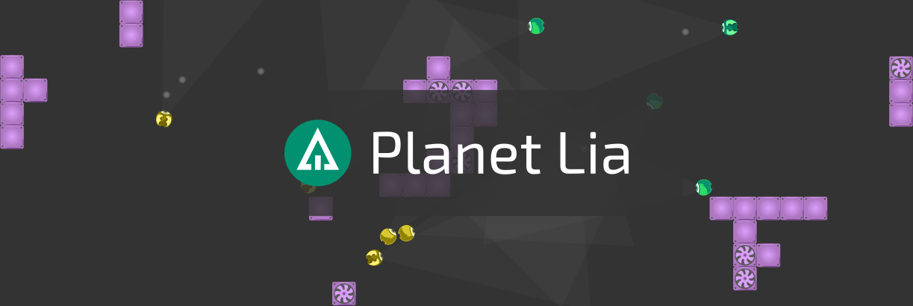

# Planet Lia 

Planet Lia is a bot programming platform for beginners and advanced coders alike, where you can use your coding skills to develop a bot for our video games and battle with it against other enthusiastic coders. Improve your coding skills, join the community and have fun!

**NOTE:** We are still in the process of rebranding from Lia Game to Planet Lia and some inconsistencies may still be present in this repository.
You are welcome to open a GitHub issue spotting any inconsistencies so that we do not overlook them.

## Our Vision
With Planet Lia we want to build an open and friendly community and hub for bot programming video game competitions. Our goal is to provide the supporting technological as well as community infrastructure so that coders can enjoy in Planet Lia games as well as easily create their own game challenges and share them with others. Our goal is to build a community where programming is a way to connect with people, to bring fun and creativity to programming, have some healthy competition and learn from one another.

## About the Repository

This is a single monorepo that holds everything related to the Planet Lia platform. Here is a quick overview of the structure of the repository:

* [backend](backend) - infrastructure that takes care of the user data, uploaded bots, generates matches, builds leaderboards and much more
* [cli](cli) - a tool that runs on your local machine and helps you develop your bots for Planet Lia games
* [game-utils](game-utils) - a set of tools that help game creators develop their Planet Lia games as effortlessly as possible
* [games](games) - a collection of all available Planet Lia games 
* [websites](websites) - code for our main Planet Lia website, the documentation and other important parts made for the web

:warning: We are still in process of open sourcing the whole Planet Lia platform and not all of its parts are already present in this repository. 
We will add the remaining parts as soon as we clean them up. 
In the current state you unfortunately can't build and run a full platform locally. 

## Code of Conduct
When participating in the Planet Lia community please follow our [Code of Conduct](CODE_OF_CONDUCT.md).

## Contributing
We are a small team behind this project and we really appreciate all the help from the community. There are many different ways that you can help the project:

* [:bug: Submit bugs and :star2: feature request](CONTRIBUTING.md#bug-report-bug-or-feature-request-star2)
* [:books: Help with the documentation](CONTRIBUTING.md#improve-documentation-closed_book) - we have large amounts of documentation that take a lot of time and effort for us to write and curate. Help is greatly appreciated!
* [:wrench: Contribute code](CONTRIBUTING.md#contribute-code-wrench) - let's build the core Planet Lia platform together
* **:video_game: Create your own game (WIP)** - you will be able to code your own game and publish it on Planet Lia platform where others will be able to compete in it. If you want to learn more then come and chat with us on [Discord](https://discord.gg/weXRxyU) where we will gladly tell you more.

**Learn how to contribute in our [Contributing Guide](CONTRIBUTING.md).**

## Join the Community

* Join our [Reddit forum](https://www.reddit.com/r/liagame/)
* Chat with us on [Discord](https://discord.gg/weXRxyU)
* Follow us on [Facebook](https://facebook.com/liagame)
* Send us an email at support@planetlia.com

## About Us
We are three students of Computer Science at the University of Ljubljana, Slovenia and we all love coding, collaborating, meeting new people and having some healthy and fun competition while improving our skills. We started working on Lia in early 2018 as a hobby project but it has since evolved into a fully fledged platform for bot programming video game competitions. We are working on Lia in our spare time so any help is appreciated!
