# Replay File Examples

A large list of replay file examples that demonstrate the features that the replay file format supports.

:bangbang: Here all examples are displayed in raw `json` format. Note that before trying out this examples you need to remove comment lines starting with `//` from the `json` as they are not supported in `json` by default. 
When you will be writing the support for storing replay files for your game you will use language specific libraries that can do that out of the box (eg. for Java).

#### Replay File Metadata
All examples include the metadata displayed below.
Assets that will be referenced in examples eg. `"block.png"` will be taken from `games/lia-1/assets/1.0/` directory (based on the `game` and `version` fields in `"gameDetails"` fields). Images will be taken from `images` sub directory, animations from `animations` and particles from `particles` sub directory.

```json5
"gameDetails": {
    "gameName": "lia-1",
    "gameVersion": "1.1",
    "assetsVersion": "1.0",
    "backgroundColor": "#333333",
    "camera": {
    "width": 176,
    "height": 99
    },
    "showEntityPath": null
},
"matchDetails": [],
"botDetails": [
    {
        "botName": "great-bot",
        "teamIndex": 0,
        "color": "#D9C72E",
        "rank": 20,
        "totalCpuTime": 0.0,
        "numberOfTimeouts": 0,
        "disqualified": false,
        "disqualificationTime": -1.0,
        "disqualificationReason": ""
    }
],
"teamsFinalOrder": [],
"charts": []
```

### Examples

Entity Types
* [TextureEntity](replay_file_examples.md#textureentity)
* TextEntity ([text](replay_file_examples.md#textentity), [time](replay_file_examples.md#textentity---numeric-text))
* [ParticleEntity](replay_file_examples.md#particleentity)

Attribute Interpolation
* [Linear Interpolation](replay_file_examples.md#linear-interpolation)
* [Step Interpolation](replay_file_examples.md#step-interpolation)
* [Sine Interpolation](replay_file_examples.md#sine-interpolation)
* [Circular Interpolation](replay_file_examples.md#circular-interpolation)
* [Mixed Interpolation](replay_file_examples.md#mixed-interpolation)

Controlling Entities
* [Changing Multiple Attributes](replay_file_examples.md#changing-multiple-attributes)
* [Multiple Entities](replay_file_examples.md#multiple-entities)
* [Ordering Entities](replay_file_examples.md#ordering-entities)
* [TextureEntity - Animation](replay_file_examples.md#textureentity---animation)
* [Attach Simple](replay_file_examples.md#attach-simple)
* [Attach Rotation](replay_file_examples.md#attach-rotation)
* [Attach Rotation & Angle](replay_file_examples.md#attach-rotation--angle)

Camera
* [Camera Movement](replay_file_examples.md#camera-movement)
* [Multiple Cameras](replay_file_examples.md#multiple-cameras)
* [HUD Elements](replay_file_examples.md#hud-elements)

Other Examples
* [Charts (Statistics)](replay_file_examples.md#charts-statistics)
* [Show Entity Path](replay_file_examples.md#show-entity-path)
* [Match Details](replay_file_examples.md#match-details)

## Entity Types

### TextureEntity

This example creates a [TextureEntity](writing_replay_files.md#textureentity) and places it in the middle of the view. 
Match viewer knows that the entity with `entityId` set to `"1"` is a TextureEntity because it has no specific prefix (eg. `"TEXT_"` or `"PARTICLE_"`).
See in [TextureEntity docs](writing_replay_files.md#textureentity) which attributes/curves are mandatory and which are optional and what are their default values.

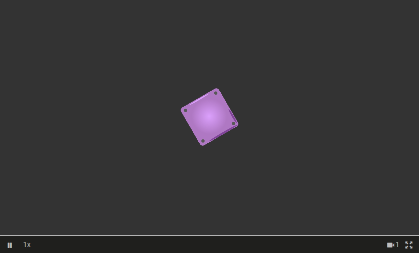

```json5
{
    // ... see metadata at the beginning of this 
    //     guide in chapter "Replay File Metadata"
    "sections": [
        // Set position X at time 0 to 96
        {
            "type": "StepSection",
            "entityId": "1",
            "attribute": "X",
            "endTime": 0,
            "endRangeValue": 96
        },
        // Set position Y at time 0 to 54
        {
            "type": "StepSection",
            "entityId": "1",
            "attribute": "Y",
            "endTime": 0,
            "endRangeValue": 54
        },
        // Set the WIDTH to 20, because height was 
        // not provided it defaults to WIDTH value
        {
            "type": "StepSection",
            "entityId": "1",
            "attribute": "WIDTH",
            "endTime": 0,
            "endRangeValue": 20
        },
        // Set the ROTATION_DEG to 30 degrees
        {
            "type": "StepSection",
            "entityId": "1",
            "attribute": "ROTATION_DEG",
            "endTime": 0,
            "endRangeValue": 30
        },
        // Set the TEXTURE of the entity to "block.png"
        {
            "type": "TextSection",
            "entityId": "1",
            "attribute": "TEXTURE",
            "endTime": 0,
            "text": "block.png"
        }
    ]
}
```

### TextEntity

This example creates a [TextEntity](writing_replay_files.md#textentity) and places it in the middle of the view. 
Match viewer knows that the entity with `entityId` set to `"TEXT_1"` is a TextEntity because it has a prefix `"TEXT_"`.
See in [TextEntity docs](writing_replay_files.md#textentity) which attributes/curves are mandatory and which are optional and what are their default values.
In this example we create a TextEntity and change its text after 2 seconds.

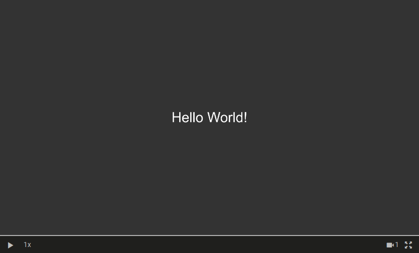

```json5
{
    // ... see metadata at the beginning of this 
    //     guide in chapter "Replay File Metadata"
    "sections": [
        // Set position X at time 0 to 96
        {
            "type": "StepSection",
            "entityId": "TEXT_1",
            "attribute": "X",
            "endTime": 0,
            "endRangeValue": 96
        },
        // Set position Y at time 0 to 54
        {
            "type": "StepSection",
            "entityId": "TEXT_1",
            "attribute": "Y",
            "endTime": 0,
            "endRangeValue": 54
        },
        // Set FONT SIZE at time 0
        {
            "type": "StepSection",
            "entityId": "TEXT_1",
            "attribute": "FONT_SIZE",
            "endTime": 0,
            "endRangeValue": 64
        },
        // Set the TEXT at time 0
        {
            "type": "TextSection",
            "entityId": "TEXT_1",
            "attribute": "TEXT",
            "endTime": 0,
            "text": "Hello World!"
        },
        // Set a new text at 2 s mark
        {
            "type": "TextSection",
            "entityId": "TEXT_1",
            "attribute": "TEXT",
            "endTime": 2,
            "text": "I have changed."
        }
    ]
}
```

### TextEntity - Numeric Text

This example creates a [TextEntity](writing_replay_files.md#textentity) and places it in the middle of the view. 
Note that this TextEntity represents numeric values of a curve as strings and can't represent regular text as in [this example](#textEntity).
This happens because we use attribute/curve `NUMBER_TEXT` instead of `TEXT`.


Match viewer knows that the entity with `entityId` set to `"TEXT_1"` is a TextEntity because it has a prefix `"TEXT_"`.
See in [TextEntity docs](writing_replay_files.md#textentity) which attributes/curves are mandatory and which are optional and what are their default values.
In this example we create a TextEntity representing time.

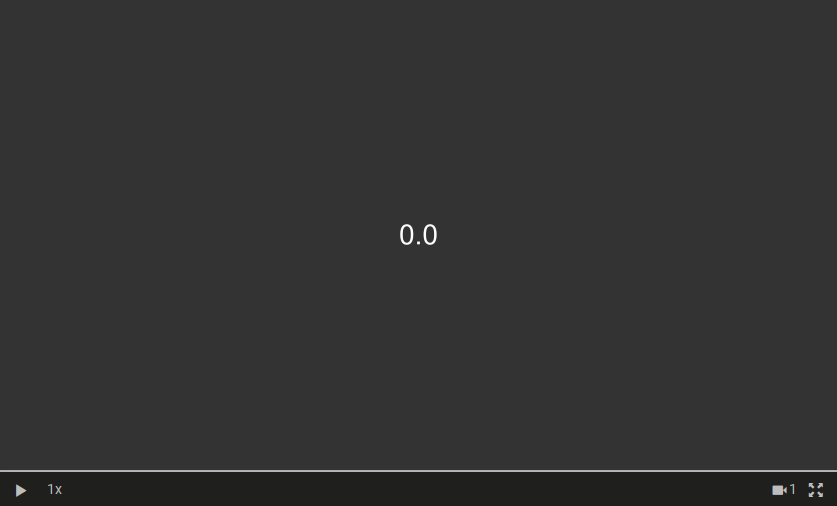

```json5
{
    // ... see metadata at the beginning of this 
    //     guide in chapter "Replay File Metadata"
    "sections": [
        // Set position X at time 0 to 96
        {
            "type": "StepSection",
            "entityId": "TEXT_1",
            "attribute": "X",
            "endTime": 0,
            "endRangeValue": 96
        },
        // Set position Y at time 0 to 54
        {
            "type": "StepSection",
            "entityId": "TEXT_1",
            "attribute": "Y",
            "endTime": 0,
            "endRangeValue": 54
        },
        // Set FONT SIZE at time 0
        {
            "type": "StepSection",
            "entityId": "TEXT_1",
            "attribute": "FONT_SIZE",
            "endTime": 0,
            "endRangeValue": 64
        },
        // Display numbers with 1 decimal 
        {
            "type": "LinearSection",
            "entityId": "TEXT_1",
            "attribute": "NUMBER_TEXT_DEC",
            "endTime": 0,
            "endRangeValue": 1
        },
        // Set the NUMBER_TEXT to 0 at time 0
        // Note that we use numeric sections
        // (eg. LinearSection or StepSection)
        {
            "type": "LinearSection",
            "entityId": "TEXT_1",
            "attribute": "NUMBER_TEXT",
            "endTime": 0,
            "endRangeValue": 0
        },
        // Set that between this section
        // and previous section for NUMBER_TEXT
        // curve the numbers will change via 
        // linear function
        {
            "type": "LinearSection",
            "entityId": "TEXT_1",
            "attribute": "NUMBER_TEXT",
            "endTime": 5,
            "endRangeValue": 5
        }
    ]
}
```

### ParticleEntity

This example creates a [ParticleEntity](writing_replay_files.md#particleentity) and places it in the middle of the view. 
Match viewer knows that the entity with `entityId` set to `"PARTICLE_1"` is a ParticleEntity because it has a prefix `"PARTICLE_"`.
See in [ParticleEntity docs](writing_replay_files.md#particleentity) which attributes/curves are mandatory and which are optional and what are their default values.
In this example we display a simple particle effect `collect-resource` which description and assets you can find [here](../../../games/lia-1/assets/1.0/particles/).


```json5
{
    // ... see metadata at the beginning of this 
    //     guide in chapter "Replay File Metadata"
    "sections": [
        // Set position X at time 0 to 96
        {
            "type": "StepSection",
            "entityId": "PARTICLE_1",
            "attribute": "X",
            "endTime": 0,
            "endRangeValue": 96
        },
        // Set position Y at time 0 to 54
        {
            "type": "StepSection",
            "entityId": "PARTICLE_1",
            "attribute": "Y",
            "endTime": 0,
            "endRangeValue": 54
        },
        // Set SCALE of the effect to 3x 
        // in order to make it bigger
        {
            "type": "StepSection",
            "entityId": "PARTICLE_1",
            "attribute": "SCALE",
            "endTime": 0,
            "endRangeValue": 3
        },
        // Specify the particle effect to use
        {
            "type": "TextSection",
            "entityId": "PARTICLE_1",
            "attribute": "EFFECT",
            "endTime": 0,
            "text": "collect-resource"
        },
        // Don't emit the effect at time 0
        {
            "type": "BooleanSection",
            "entityId": "PARTICLE_1",
            "attribute": "EMIT",
            "endTime": 0,
            "endRangeValue": false
        },
        // Emit an effect at time 0.5 s
        {
            "type": "BooleanSection",
            "entityId": "PARTICLE_1",
            "attribute": "EMIT",
            "endTime": 0.5,
            "endRangeValue": true
        },
        // Replay ends with the last 
        // provided endTime of any curve.
        // This section is only used 
        // to extend replay duration to 3s
        {
            "type": "BooleanSection",
            "entityId": "CURVE_END_TIME",
            "attribute": "NONE",
            "endTime": 3,
            "endRangeValue": true
        }
    ]
}
```

## Attribute Interpolation

### Linear Interpolation

This example demonstrates how a [LinearSection](writing_replay_files.md#linearsection) can be used to change the attributes of a [TextureEntity](writing_replay_files.md#textureentity) through time.

Here a TextureEntity represents a block and changes X coordinate linearly.

*NOTE: Animation below might be laggy because it is stored as .gif.*


```json5
{
    // ... see metadata at the beginning of this 
    //     guide in chapter "Replay File Metadata"
    "sections": [
        // Set position X at time 0 to 96
        {
            "type": "StepSection",
            "entityId": "1",
            "attribute": "X",
            "endTime": 0,
            "endRangeValue": 60
        },
        // Set position Y at time 0 to 54
        {
            "type": "StepSection",
            "entityId": "1",
            "attribute": "Y",
            "endTime": 0,
            "endRangeValue": 54
        },
        // Set the WIDTH to 20, because height was 
        // not provided it defaults to WIDTH value
        {
            "type": "StepSection",
            "entityId": "1",
            "attribute": "WIDTH",
            "endTime": 0,
            "endRangeValue": 20
        },
        // Set the TEXTURE of the entity to "block.png"
        {
            "type": "TextSection",
            "entityId": "1",
            "attribute": "TEXTURE",
            "endTime": 0,
            "text": "block.png"
        },
        // Move linearly in between previous 
        // X section and this X section
        {
            "type": "LinearSection",
            "entityId": "1",
            "attribute": "X",
            "endTime": 3,
            "endRangeValue": 140
        }
    ]
}
```

### Step Interpolation

This example demonstrates how a [StepSection](writing_replay_files.md#stepsection) can be used to change the attributes of a [TextureEntity](writing_replay_files.md#textureentity) through time.

Here a TextureEntity represents a block and changes X in a stepping (teleport) fashion.

*NOTE: Animation below might be laggy because it is stored as .gif.*

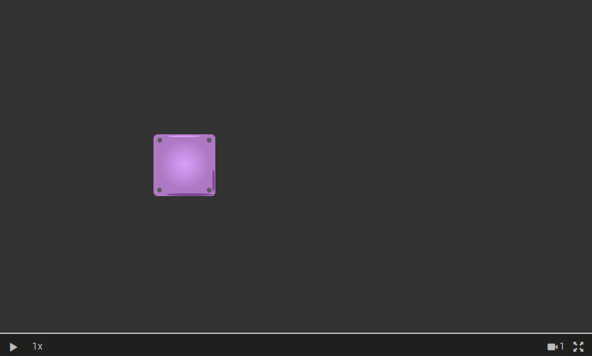

```json5
{
    // ... see metadata at the beginning of this 
    //     guide in chapter "Replay File Metadata"
    "sections": [
        // Set position X at time 0 to 96
        {
            "type": "StepSection",
            "entityId": "1",
            "attribute": "X",
            "endTime": 0,
            "endRangeValue": 60
        },
        // Set position Y at time 0 to 54
        {
            "type": "StepSection",
            "entityId": "1",
            "attribute": "Y",
            "endTime": 0,
            "endRangeValue": 54
        },
        // Set the WIDTH to 20, because height was 
        // not provided it defaults to WIDTH value
        {
            "type": "StepSection",
            "entityId": "1",
            "attribute": "WIDTH",
            "endTime": 0,
            "endRangeValue": 20
        },
        // Set the TEXTURE of the entity to "block.png"
        {
            "type": "TextSection",
            "entityId": "1",
            "attribute": "TEXTURE",
            "endTime": 0,
            "text": "block.png"
        },
        // Change (step) immediately at time 1.5 seconds
        // to a new position
        {
            "type": "StepSection",
            "entityId": "1",
            "attribute": "X",
            "endTime": 1.5,
            "endRangeValue": 140
        }
    ]
}
```

### Sine Interpolation

This example demonstrates how a [SineSection](writing_replay_files.md#sinesection) can be used to change the attributes of a [TextureEntity](writing_replay_files.md#textureentity) through time.

Here a TextureEntity represents a block and changes X as a sine function.

*NOTE: Animation below might be laggy because it is stored as .gif.*

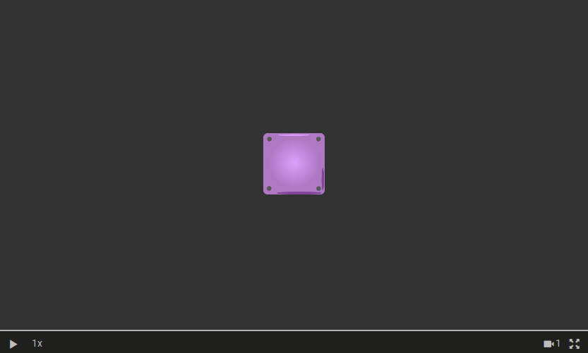

```json5
{
    // ... see metadata at the beginning of this 
    //     guide in chapter "Replay File Metadata"
    "sections": [
        // Set position X at time 0 to 96
        {
            "type": "StepSection",
            "entityId": "1",
            "attribute": "X",
            "endTime": 0,
            "endRangeValue": 96
        },
        // Set position Y at time 0 to 54
        {
            "type": "StepSection",
            "entityId": "1",
            "attribute": "Y",
            "endTime": 0,
            "endRangeValue": 54
        },
        // Set the WIDTH to 20, because height was 
        // not provided it defaults to WIDTH value
        {
            "type": "StepSection",
            "entityId": "1",
            "attribute": "WIDTH",
            "endTime": 0,
            "endRangeValue": 20
        },
        // Set the TEXTURE of the entity to "block.png"
        {
            "type": "TextSection",
            "entityId": "1",
            "attribute": "TEXTURE",
            "endTime": 0,
            "text": "block.png"
        },
        // Change X between previous section time and 4 s
        // using a sine function A + r * sin(B * (t - t0) + C)
        {
            "type": "SineSection",
            "entityId": "1",
            "attribute": "X",
            "endTime":4,
            "t0": 0,
            "A": 96,
            "r": 60,
            "B": 1,
            "C": 0
        }
    ]
}
```

### Circular Interpolation

This example demonstrates how a two [SineSection](writing_replay_files.md#sinesection) can be used to represent a circular movement of a [TextureEntity](writing_replay_files.md#textureentity) through time.

:bangbang: Note that when creating your game you don't need to manually calculate what the sine functions are for x and y attribute in order to move the entity around the circle. In our libraries we already provide a function `getCircularMovementParametricEquations` that takes parameters `currentTime`, `velocity`, `rotationVelocity`, `angle`, `x` and `y` of the entity and calculates the corresponding sine x and sine y functions for this kind of circular movement.

Here a TextureEntity represents a block and moves over the map in a circle.

*NOTE: Animation below might be laggy because it is stored as .gif.*

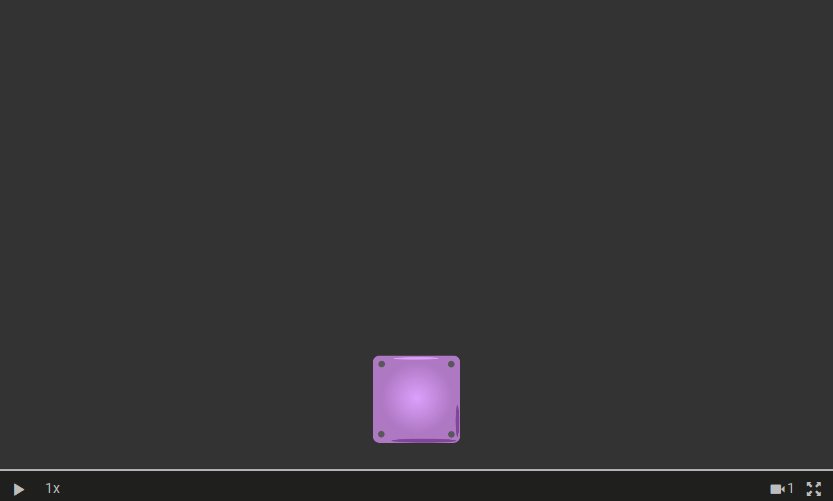

```json5
{
    // ... see metadata at the beginning of this 
    //     guide in chapter "Replay File Metadata"
    "sections": [
        // Set position X at time 0 to 96
        {
            "type": "StepSection",
            "entityId": "1",
            "attribute": "X",
            "endTime": 0,
            "endRangeValue": 96
        },
        // Set position Y at time 0 to 16
        {
            "type": "StepSection",
            "entityId": "1",
            "attribute": "Y",
            "endTime": 0,
            "endRangeValue": 16
        },
        // Set the WIDTH to 20, because height was 
        // not provided it defaults to WIDTH value
        {
            "type": "StepSection",
            "entityId": "1",
            "attribute": "WIDTH",
            "endTime": 0,
            "endRangeValue": 20
        },
        // Set the TEXTURE of the entity to "block.png"
        {
            "type": "TextSection",
            "entityId": "1",
            "attribute": "TEXTURE",
            "endTime": 0,
            "text": "block.png"
        },
        // Interpolate X as sine function 
        // (x parametric equation of a circle)
        {
            "type": "SineSection",
            "entityId": "1",
            "attribute": "X",
            "endTime": 9,
            "t0": 0,
            "A": 96,
            "r": 38,
            "B": -1,
            "C": 0
        },
        // Interpolate Y as sine function
        // (y parametric equation of a circle)
        {
            "type": "SineSection",
            "entityId": "1",
            "attribute": "Y",
            "endTime": 9,
            "t0": 0,
            "A": 54,
            "r": 38,
            "B": -1,
            "C": -1.6
        }
    ]
}
```

### Mixed Interpolation

This example demonstrates how multiple section types can be used to represent the same attribute. Here we use [LinearSection](writing_replay_files.md#linearsection) and [StepSection](writing_replay_files.md#stepsection) to represent changes of the SCALE attribute of a [TextureEntity](writing_replay_files.md#textureentity) through time.

Here a TextureEntity represents a block which SCALE changes in the following way:
* between `0 s` and `4 s`: changes linearly from scale `1` to scale `3`
* between `4 s` and `6 s`: stays at scale `3` and at time `6 s` jumps to scale `0.5`
* between `6 s` and `8 s`: stays at scale `0.5` and then at `8 s` jumps to scale `0.5` (stays the same)
* between `8 s` and `10 s`: changes linearly from scale `0.5` to scale `0.2` 

*NOTE: Animation below might be laggy because it is stored as .gif.*

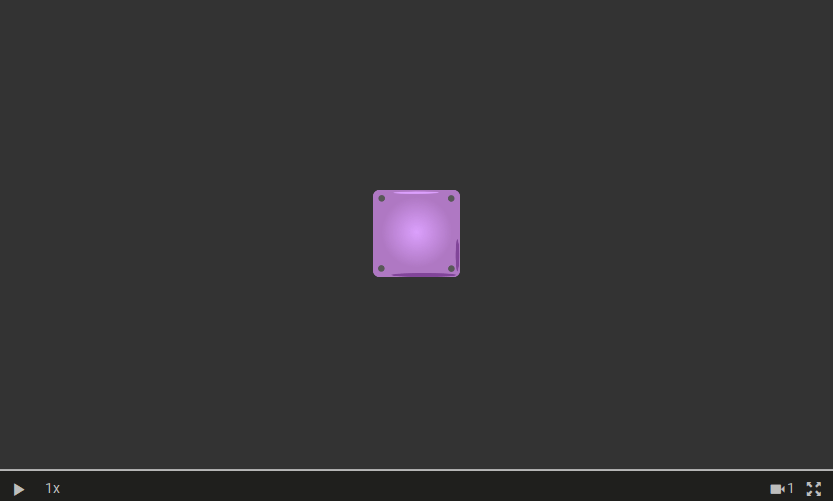

```json5
{
    // ... see metadata at the beginning of this 
    //     guide in chapter "Replay File Metadata"
    "sections": [
        // Set position X at time 0 to 96
        {
            "type": "StepSection",
            "entityId": "1",
            "attribute": "X",
            "endTime": 0,
            "endRangeValue": 96
        },
        // Set position Y at time 0 to 54
        {
            "type": "StepSection",
            "entityId": "1",
            "attribute": "Y",
            "endTime": 0,
            "endRangeValue": 54
        },
        // Set the WIDTH to 20, because height was 
        // not provided it defaults to WIDTH value
        {
            "type": "StepSection",
            "entityId": "1",
            "attribute": "WIDTH",
            "endTime": 0,
            "endRangeValue": 20
        },
        // Set the TEXTURE of the entity to "block.png"
        {
            "type": "TextSection",
            "entityId": "1",
            "attribute": "TEXTURE",
            "endTime": 0,
            "text": "block.png"
        },
        {
            "type": "StepSection",
            "entityId": "1",
            "attribute": "SCALE",
            "endTime": 0,
            "endRangeValue": 1
        },
        {
            "type": "LinearSection",
            "entityId": "1",
            "attribute": "SCALE",
            "endTime": 4,
            "endRangeValue": 3
        },
        {
            "type": "StepSection",
            "entityId": "1",
            "attribute": "SCALE",
            "endTime": 6,
            "endRangeValue": 0.5
        },
        {
            "type": "StepSection",
            "entityId": "1",
            "attribute": "SCALE",
            "endTime": 8,
            "endRangeValue": 0.5
        },
        {
            "type": "LinearSection",
            "entityId": "1",
            "attribute": "SCALE",
            "endTime": 10,
            "endRangeValue": 0.2
        }
    ]
}
```

## Controlling Entities

You can control all entity types ([TextureEntity](writing_replay_files.md#textureentity), [TextEntity](writing_replay_files.md#textentity), [ParticleEntity](writing_replay_files.md#particleentity)) in a similar way by changing values of their attributes.

### Changing Multiple Attributes

This example demonstrates how to use different section types (eg. [LinearSection](writing_replay_files.md#linearsection), [StepSection](writing_replay_files.md#stepsection), [BooleanSection](writing_replay_files.md#booleansection), [TextSection](writing_replay_files.md#textsection)) to change the attributes of a [TextureEntity](writing_replay_files.md#textureentity) through time.

Here a TextureEntity changes the following attributes through time:
* `X` - moves linearly from left to right
* `WIDTH` - expands to `40` at `3 s` and shrinks back to `20` at `6 s`
* `ROTATION_DEG` - keeps slowly rotating form `0 deg` to `360 deg` in `10 s` 
* `OPACITY` - goes from `0.2` to `1` in first `4 s`
* `TEXTURE` - swaps the image representing the entity
* `VISIBILITY` - make unit invisible between `8 s` and `9 s` mark

:bangbang: **Querying for attribute by time** - note that section always controls a time between the `endTime` of the previous section and its own `endTime`. If there is no previous section then querying for the time before the `entTime` of this first section will throw an error. But if the queried time is larger then the `endTime` of a last section of a specific attribute, the last value of the last section will be returned. But also note that [StepSection](writing_replay_files.md#stepsection), [BooleanSection](writing_replay_files.md#booleansection), [TextSection](writing_replay_files.md#textsection) in their time before their `endTime` always return the end value of the previous section.

:bangbang: **Importance of section ordering** - note that sections that belong to the same attribute must be ordered chronologically when written to the replay file while sections that belong to different attributes in a replay file can be chronologically mixed.

*NOTE: Animation below might be laggy because it is stored as .gif.*

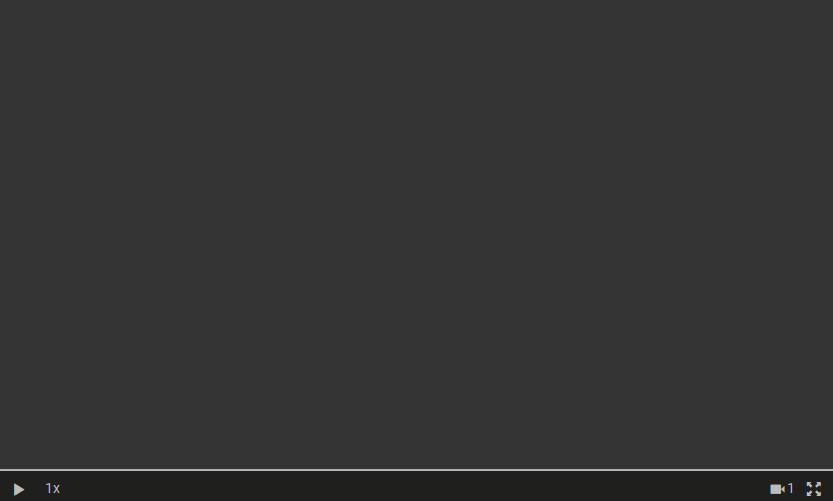

```json5
{
    // ... see metadata at the beginning of this 
    //     guide in chapter "Replay File Metadata"
    "sections": [
        // Change X between 90 and 110 
        // linearly in first 3 seconds
        {
            "type": "StepSection",
            "entityId": "1",
            "attribute": "X",
            "endTime": 0,
            "endRangeValue": 90
        },
        {
            "type": "LinearSection",
            "entityId": "1",
            "attribute": "X",
            "endTime": 3,
            "endRangeValue": 110
        },
        // Set Y to be 54
        {
            "type": "StepSection",
            "entityId": "1",
            "attribute": "Y",
            "endTime": 0,
            "endRangeValue": 54
        },
        // Change WIDTH from 20 to 40 after
        // 3 s and then back to 20 after 6s
        {
            "type": "StepSection",
            "entityId": "1",
            "attribute": "WIDTH",
            "endTime": 0,
            "endRangeValue": 20
        },
        {
            "type": "StepSection",
            "entityId": "1",
            "attribute": "WIDTH",
            "endTime": 3,
            "endRangeValue": 40
        },
        {
            "type": "StepSection",
            "entityId": "1",
            "attribute": "WIDTH",
            "endTime": 6,
            "endRangeValue": 20
        },
        // Start with "block.png" texture and then 
        // change to "warrior-1.png" texture at 6 s
        {
            "type": "TextSection",
            "entityId": "1",
            "attribute": "TEXTURE",
            "endTime": 0,
            "text": "block.png"
        },
        {
            "type": "TextSection",
            "entityId": "1",
            "attribute": "TEXTURE",
            "endTime": 6,
            "text": "warrior-1.png"
        },
        // Linearly change ROTATION_DEG between 0 
        // deg at time 0 s and 360 deg at time 12 s
        {
            "type": "StepSection",
            "entityId": "1",
            "attribute": "ROTATION_DEG",
            "endTime": 0,
            "endRangeValue": 0
        },
        {
            "type": "LinearSection",
            "entityId": "1",
            "attribute": "ROTATION_DEG",
            "endTime": 12,
            "endRangeValue": 360
        },
        // Linearly change the OPACITY from
        // 0 to 1 in first 4 s
        {
            "type": "LinearSection",
            "entityId": "1",
            "attribute": "OPACITY",
            "endTime": 0,
            "endRangeValue": 0
        },
        {
            "type": "LinearSection",
            "entityId": "1",
            "attribute": "OPACITY",
            "endTime": 4,
            "endRangeValue": 1
        },
        // Make the unit visible between 0 s
        // and 8 s, invisible between 8 s and 
        // 9 s and again visible after 9 s
        {
            "type": "BooleanSection",
            "entityId": "1",
            "attribute": "VISIBILITY",
            "endTime": 0,
            "endRangeValue": true
        },
        {
            "type": "BooleanSection",
            "entityId": "1",
            "attribute": "VISIBILITY",
            "endTime": 8,
            "endRangeValue": false
        },
        {
            "type": "BooleanSection",
            "entityId": "1",
            "attribute": "VISIBILITY",
            "endTime": 9,
            "endRangeValue": true
        }
    ]
}
```

### Multiple Entities

This example demonstrates how to display multiple entities at the same time.

Here we display two [TextureEntities](writing_replay_files.md#textureentity) and one [TextEntity](writing_replay_files.md#textentity).

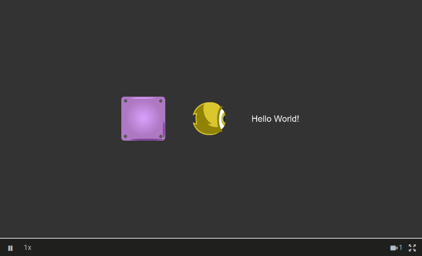

```json5
{
    // ... see metadata at the beginning of this 
    //     guide in chapter "Replay File Metadata"
    "sections": [
        // Create first entity (block)
        {
            "type": "StepSection",
            "entityId": "1",
            "attribute": "X",
            "endTime": 0,
            "endRangeValue": 65
        },
        {
            "type": "StepSection",
            "entityId": "1",
            "attribute": "Y",
            "endTime": 0,
            "endRangeValue": 54
        },
        {
            "type": "StepSection",
            "entityId": "1",
            "attribute": "WIDTH",
            "endTime": 0,
            "endRangeValue": 20
        },
        {
            "type": "TextSection",
            "entityId": "1",
            "attribute": "TEXTURE",
            "endTime": 0,
            "text": "block.png"
        },
        // Create second entity (warrior)
        {
            "type": "StepSection",
            "entityId": "2",
            "attribute": "X",
            "endTime": 0,
            "endRangeValue": 95
        },
        {
            "type": "StepSection",
            "entityId": "2",
            "attribute": "Y",
            "endTime": 0,
            "endRangeValue": 54
        },
        {
            "type": "StepSection",
            "entityId": "2",
            "attribute": "WIDTH",
            "endTime": 0,
            "endRangeValue": 15
        },
        {
            "type": "TextSection",
            "entityId": "2",
            "attribute": "TEXTURE",
            "endTime": 0,
            "text": "warrior-1.png"
        },
        // Create thrid entity (text)
        {
            "type": "StepSection",
            "entityId": "TEXT_1",
            "attribute": "X",
            "endTime": 0,
            "endRangeValue": 125
        },
        {
            "type": "StepSection",
            "entityId": "TEXT_1",
            "attribute": "Y",
            "endTime": 0,
            "endRangeValue": 54
        },
        {
            "type": "StepSection",
            "entityId": "TEXT_1",
            "attribute": "FONT_SIZE",
            "endTime": 0,
            "endRangeValue": 40
        },
        {
            "type": "TextSection",
            "entityId": "TEXT_1",
            "attribute": "TEXT",
            "endTime": 0,
            "text": "Hello World!"
        }
    ]
}
```

### Ordering Entities

This example demonstrates how to order different entities to determine which one is drawn on top of which.

For that you can use `LAYER` attribute of [TextureEntity](writing_replay_files.md#textureentity), [TextEntity](writing_replay_files.md#textentity) or [ParticleEntity](writing_replay_files.md#particleentity). 
The entities with `LAYER` values greater than other entities will be drawn on top of them (eg. entity with `LAYER` value 2 will be drawn on top of entity with value 1).

Here we display two [TextureEntities](writing_replay_files.md#textureentity) where block entity starts on layer `1`, warrior entity on layer `2` and after `2 s` block entity is moved to layer `3` and is thus after that time rendered on top of warrior entity.

*NOTE: Animation below might be laggy because it is stored as .gif.*

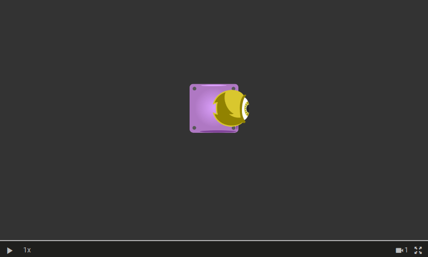

```json5
{
    // ... see metadata at the beginning of this 
    //     guide in chapter "Replay File Metadata"
    "sections": [
        // Create first entity on layer 1 (block)
        {
            "type": "StepSection",
            "entityId": "1",
            "attribute": "X",
            "endTime": 0,
            "endRangeValue": 88
        },
        {
            "type": "StepSection",
            "entityId": "1",
            "attribute": "Y",
            "endTime": 0,
            "endRangeValue": 54
        },
        {
            "type": "StepSection",
            "entityId": "1",
            "attribute": "WIDTH",
            "endTime": 0,
            "endRangeValue": 20
        },
        {
            "type": "TextSection",
            "entityId": "1",
            "attribute": "TEXTURE",
            "endTime": 0,
            "text": "block.png"
        },
        {
            "type": "StepSection",
            "entityId": "1",
            "attribute": "LAYER",
            "endTime": 0,
            "endRangeValue": 1
        },
        // Create second entity on layer 2 (warrior)
        {
            "type": "StepSection",
            "entityId": "2",
            "attribute": "X",
            "endTime": 0,
            "endRangeValue": 95
        },
        {
            "type": "StepSection",
            "entityId": "2",
            "attribute": "Y",
            "endTime": 0,
            "endRangeValue": 54
        },
        {
            "type": "StepSection",
            "entityId": "2",
            "attribute": "WIDTH",
            "endTime": 0,
            "endRangeValue": 15
        },
        {
            "type": "TextSection",
            "entityId": "2",
            "attribute": "TEXTURE",
            "endTime": 0,
            "text": "warrior-1.png"
        },
        {
            "type": "StepSection",
            "entityId": "2",
            "attribute": "LAYER",
            "endTime": 0,
            "endRangeValue": 2
        },
        // Move block entity to layer 3
        {
            "type": "StepSection",
            "entityId": "1",
            "attribute": "LAYER",
            "endTime": 1,
            "endRangeValue": 3
        }
    ]
}
```

### TextureEntity - Animation

This example shows how to use sprite animations with [TextureEntity](writing_replay_files.md#textureentity).
It first displays a `"warrior-1.png"` image and after `1 s` it switches to displaying a simple shooting animation named `"shooting_warrior_1"`.

In this example animation consists out of 3 images, first two being displayed for `0.25 s` and the last one until the `TEXTURE` attribute has a different value since the animation is not set to loop. See this ilustrated below:

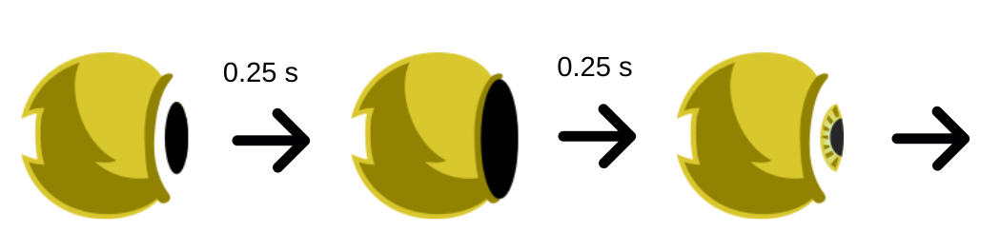

Learn more about [Animations format](#animations-format).

*NOTE: Animation below might be laggy because it is stored as .gif.*


```json5
{
    // ... see metadata at the beginning of this 
    //     guide in chapter "Replay File Metadata"
    "sections": [
        // Set position X at time 0 to 96
        {
            "type": "StepSection",
            "entityId": "1",
            "attribute": "X",
            "endTime": 0,
            "endRangeValue": 96
        },
        // Set position Y at time 0 to 54
        {
            "type": "StepSection",
            "entityId": "1",
            "attribute": "Y",
            "endTime": 0,
            "endRangeValue": 54
        },
        // Set the WIDTH to 20, because height was 
        // not provided it defaults to WIDTH value
        {
            "type": "StepSection",
            "entityId": "1",
            "attribute": "WIDTH",
            "endTime": 0,
            "endRangeValue": 20
        },
        // Start with a normal image as a TEXTURE
        {
            "type": "TextSection",
            "entityId": "1",
            "attribute": "TEXTURE",
            "endTime": 0,
            "text": "warrior-1.png"
        },
        // Set the TEXTURE of the entity to 
        // "shooting_warrior_1" animation
        {
            "type": "TextSection",
            "entityId": "1",
            "attribute": "TEXTURE",
            "endTime": 1,
            "text": "shooting_warrior_1"
        },
         // Replay ends with the last 
        // provided endTime of any curve.
        // This section is only used 
        // to extend replay duration to 3s
        {
            "type": "BooleanSection",
            "entityId": "CURVE_END_TIME",
            "attribute": "NONE",
            "endTime": 4,
            "endRangeValue": true
        }
    ]
}
```

### Attach Simple

This example shows how to attach one entity to another.

Here we have two [TextureEntities](writing_replay_files.md#textureentity). 
The yellow entity moves around the map. 
The green entity attaches to the yellow entity and moves with it automatically so that it is always away from it for `10` on `X` and `20` on `Y`.

***IMPORTANT:** By attaching entities to other entities you can easily make things like health bars, viewing areas, ammo bars, etc. that attach to other entities and move with them.*

Green entity attaches to the yellow entity by setting the following Attach parameters to the following values (see what each of them does [here](writing_replay_files.md#attachsection)):
- `attachX`: **true**
- `attachY`: **true**
- `attachRotation`: false (see an [example](#attach-rotation) when set to `true`)
- `attachAngle`: false (see an [example](#attach-rotation-&-angle) when set to `true`)
- `attachScale`: false
- `attachVisibility`: false

If an entity gets attached to another entity it moves with it and its attributes (eg. `X`, `Y`) are treated within local coordinate system that moves with the entity it attaches to.

*NOTE: Animation below might be laggy because it is stored as .gif.*

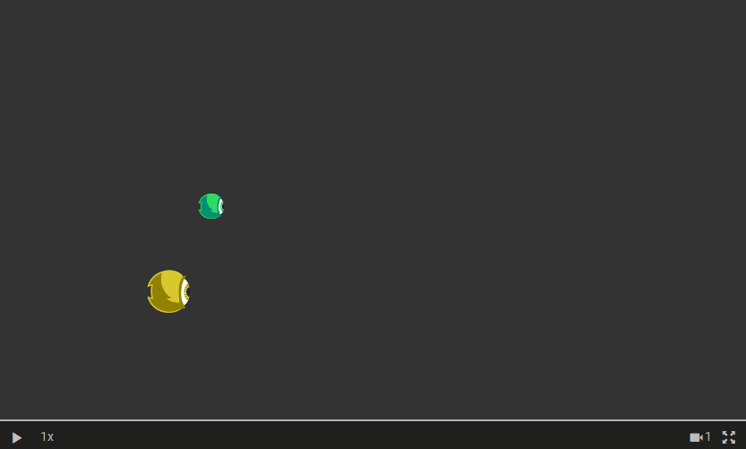

```json5
{
    // ... see metadata at the beginning of this 
    //     guide in chapter "Replay File Metadata"
    "sections": [
        // Create the yellow entity and make it
        // move first linearly on x axis, then 
        // rotate for 90 degrees and then move
        // it linearly on y axis
        {
            "type": "StepSection",
            "entityId": "1",
            "attribute": "X",
            "endTime": 0,
            "endRangeValue": 40
        },
        {
            "type": "StepSection",
            "entityId": "1",
            "attribute": "Y",
            "endTime": 0,
            "endRangeValue": 30
        },
        {
            "type": "StepSection",
            "entityId": "1",
            "attribute": "WIDTH",
            "endTime": 0,
            "endRangeValue": 10
        },
        {
            "type": "StepSection",
            "entityId": "1",
            "attribute": "ROTATION_DEG",
            "endTime": 0,
            "endRangeValue": 0
        },
        {
            "type": "TextSection",
            "entityId": "1",
            "attribute": "TEXTURE",
            "endTime": 0,
            "text": "warrior-1.png"
        },
        {
            "type": "LinearSection",
            "entityId": "1",
            "attribute": "X",
            "endTime": 3,
            "endRangeValue": 110
        },
        {
            "type": "StepSection",
            "entityId": "1",
            "attribute": "ROTATION_DEG",
            "endTime": 3,
            "endRangeValue": 0
        },
        {
            "type": "LinearSection",
            "entityId": "1",
            "attribute": "ROTATION_DEG",
            "endTime": 5,
            "endRangeValue": 90
        },
        {
            "type": "LinearSection",
            "entityId": "1",
            "attribute": "Y",
            "endTime": 5,
            "endRangeValue": 30
        },
        {
            "type": "LinearSection",
            "entityId": "1",
            "attribute": "Y",
            "endTime": 7,
            "endRangeValue": 84
        },
        // Create the green entity and
        // attach it to the yellow entity
        {
            "type": "StepSection",
            "entityId": "2",
            "attribute": "X",
            "endTime": 0,
            "endRangeValue": 10
        },
        {
            "type": "StepSection",
            "entityId": "2",
            "attribute": "Y",
            "endTime": 0,
            "endRangeValue": 20
        },
        {
            "type": "StepSection",
            "entityId": "2",
            "attribute": "WIDTH",
            "endTime": 0,
            "endRangeValue": 6
        },
        {
            "type": "TextSection",
            "entityId": "2",
            "attribute": "TEXTURE",
            "endTime": 0,
            "text": "warrior-2.png"
        },
        // HERE you attach entity with
        // id "2" to entity with id "1"
        {
            "type": "AttachSection",
            "entityId": "2",
            "attribute": "ATTACH",
            "endTime": 0.0,
            "attachToEntityId": "1",
            "attachX": true,
            "attachY": true,
            "attachRotation": false,
            "attachAngle": false,
            "attachScale": false,
            "attachVisibility": false
        }
    ]
}
```

### Attach Rotation

This example shows how to attach one entity to another.

:bangbang: The example is exactly the same as the the [Attach Simple example](#attach-simple).
The only change is that parameter `attachRotation` is set to `true`. 
This makes the green entity rotate around the yellow entity as the yellow entity rotates.
Note that the relative position between green and yellow entities also changes since the rotation of the entity is taken into the account.

*NOTE: Animation below might be laggy because it is stored as .gif.*


```json5
{
    // ... see metadata at the beginning of this 
    //     guide in chapter "Replay File Metadata"
    "sections": [
        // ...
        // Everything is the same as in "Attach Simple" 
        // example except "attachRotation" field in the 
        // section below is set to true.
        // ...
        {
            "type": "AttachSection",
            "entityId": "2",
            "attribute": "ATTACH",
            "endTime": 0.0,
            "attachToEntityId": "1",
            "attachX": true,
            "attachY": true,
            "attachRotation": true,  // <-- Change
            "attachAngle": false,
            "attachScale": false,
            "attachVisibility": false
        }
    ]
}
```

### Attach Rotation & Angle

This example shows how to attach one entity to another.

:bangbang: The example is exactly the same as the the [Attach Simple example](#attach-simple).
The only change is that parameters `attachRotation` and `attachScale` are set to `true`. 
This makes the green entity rotate around the yellow entity as the yellow entity rotates as well as rotate around its own center as the yellow entities rotates.
Note that the relative position between green and yellow entities also changes since the rotation of the entity is taken into the account.

*NOTE: Animation below might be laggy because it is stored as .gif.*

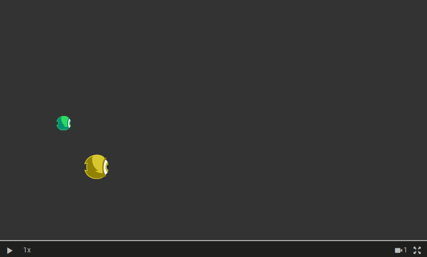

```json5
{
    // ... see metadata at the beginning of this 
    //     guide in chapter "Replay File Metadata"
    "sections": [
        // ...
        // Everything is the same as in "Attach Simple" 
        // example except "attachRotation" field in the 
        // section below is set to true.
        // ...
        {
            "type": "AttachSection",
            "entityId": "2",
            "attribute": "ATTACH",
            "endTime": 0.0,
            "attachToEntityId": "1",
            "attachX": true,
            "attachY": true,
            "attachRotation": true,  // <-- Change
            "attachAngle": true,  // <-- Change
            "attachScale": false,
            "attachVisibility": false
        }
    ]
}
```

## Camera

### Camera Movement

This example demonstrates how to create your own [Camera](writing_replay_files.md#camera). 


Here we create a simple map out of 1 obstacles and use two entities from [Attach Rotation & Angle](#attach-rotation-&-angle) example.
Then we create a camera object zooms and rotates through time. 
You can also move the camera by changing values of attributes `X` and `Y`.


*NOTE: Animation below might be laggy because it is stored as .gif.*

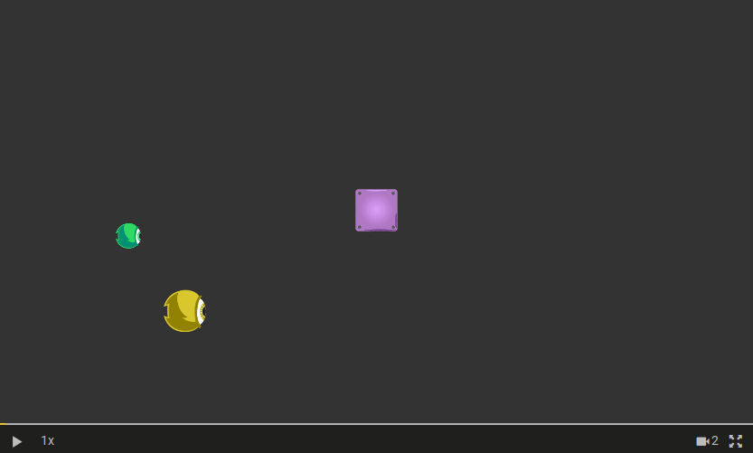

```json5
{
    // ... see metadata at the beginning of this 
    //     guide in chapter "Replay File Metadata"
    "sections": [
        // ...
        // We didn't provide sections for two obstacles and 
        // moving entity here as it would take to much space.
        // Check other examples in this guide to understand
        // how you can create and move entities on the map.
        // ...
        // Create a camera
                {
            "type": "LinearSection",
            "entityId": "CAMERA_1",
            "attribute": "X",
            "endTime": 0,
            "endRangeValue": 88
          },
          {
            "type": "LinearSection",
            "entityId": "CAMERA_1",
            "attribute": "Y",
            "endTime": 0,
            "endRangeValue": 54
          },
          {
            "type": "LinearSection",
            "entityId": "CAMERA_1",
            "attribute": "ZOOM",
            "endTime": 0,
            "endRangeValue": 1
          },
          {
            "type": "LinearSection",
            "entityId": "CAMERA_1",
            "attribute": "ROTATION_DEG",
            "endTime": 0,
            "endRangeValue": 0
          },
          // Make camera zoom out to x0.3
          // linearly until 3 s
          {
            "type": "LinearSection",
            "entityId": "CAMERA_1",
            "attribute": "ZOOM",
            "endTime": 3,
            "endRangeValue": 0.3
          },
          // Make camera zoom back in to
          // x1.2
          {
            "type": "LinearSection",
            "entityId": "CAMERA_1",
            "attribute": "ZOOM",
            "endTime": 6,
            "endRangeValue": 1.2
          },
          // Make the camera rotate for 
          // 360 deg between 7 s and 9 s
          {
            "type": "LinearSection",
            "entityId": "CAMERA_1",
            "attribute": "ROTATION_DEG",
            "endTime": 7,
            "endRangeValue": 0
          },
          {
            "type": "LinearSection",
            "entityId": "CAMERA_1",
            "attribute": "ROTATION_DEG",
            "endTime": 9,
            "endRangeValue": 360
          }
    ]
}
```

### Multiple Cameras 

In order to support more [Camera](writing_replay_files.md#camera) objects in the same replay file you simply create multiple objects with different `entityId`s.
The cameras will be automatically displayed in the match viewer controls.

Check [Camera Movement](#camera-movement) example to see how to create a Camera object.

### HUD Elements 

When using [Camera](writing_replay_files.md#camera) that for example move around the map, zoom in our out etc., the entities that are on the map automatically get out of view when camera is moving, get bigger or smaller when camera is zooming etc.

Often we want to have certain entities that are always on the fixed spot on the match screen regarding of what camera is doing. 
Some examples might be HUD elements, match time, team stats, labels with statistics, etc.
To make an entity not move with the camera, simply make it use the `entityId` with a prefix `"HUD_"`. 

For example an entity that display current time in the game on the screen can have an `entityId` set to `"HUD_timer"` and its position set with attributes `X` and `Y` will not be influenced by what is the camera doing.

## Other Examples

### Charts (Statistics)

This example demonstrates how to create [charts](writing_replay_files.md#charts) that displays besides a match viewer.

Each chart represent values from a curve/attribute that is described in `"sections"` part of the replay file.

Here we create two charts (any number of charts is allowed), one that displays the `X` attribute of a warrior entity and the other displays values from a standalone curve.

*NOTE: Animation below might be laggy because it is stored as .gif.*

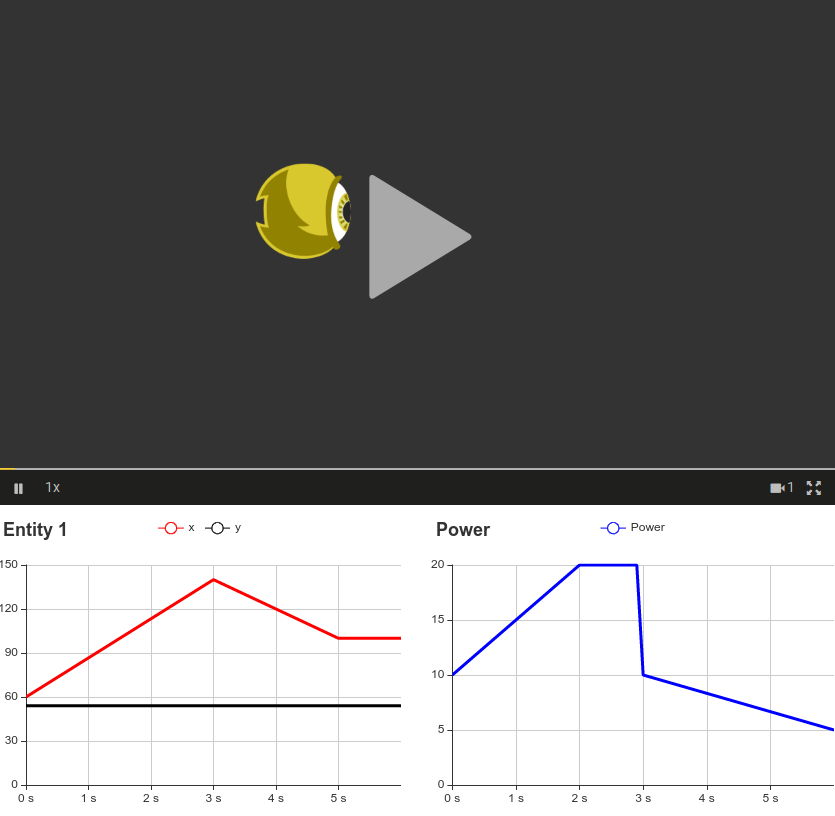

```json5
{
    // ... see metadata at the beginning of this 
    //     guide in chapter "Replay File Metadata"
    "charts": [
        // Create a chart that displays 
        // X and Y attributes of an entity
        {
            "type": "Chart",
            "name": "Entity 1",
            "series": [
                {
                    "name": "x",
                    "color": "#FF0000",
                    "curveRef": {
                        "entityId": "1",
                        "attribute": "X"
                    }
                },
                {
                    "name": "y",
                    "color": "#000000",
                    "curveRef": {
                        "entityId": "1",
                        "attribute": "Y"
                    }
                }
            ]
        },
        // Create a chart that displays 
        // curve with entityId "CURVE_power"
        {
            "type": "Chart",
            "name": "Power",
            "series": [
                {
                    "name": "Power",
                    "color": "#0000FF",
                    "curveRef": {
                        "entityId": "CURVE_power",
                        "attribute": "NONE"
                    }
                }
            ]
        }
    ],
    "sections": [
        // Create warrior entity
        {
            "type": "StepSection",
            "entityId": "1",
            "attribute": "X",
            "endTime": 0,
            "endRangeValue": 60
        },
        {
            "type": "StepSection",
            "entityId": "1",
            "attribute": "Y",
            "endTime": 0,
            "endRangeValue": 54
        },
        {
            "type": "StepSection",
            "entityId": "1",
            "attribute": "WIDTH",
            "endTime": 0,
            "endRangeValue": 20
        },
        {
            "type": "TextSection",
            "entityId": "1",
            "attribute": "TEXTURE",
            "endTime": 0,
            "text": "warrior-1.png"
        },
        // Move warrior entity linearly to
        // new position
        {
            "type": "LinearSection",
            "entityId": "1",
            "attribute": "X",
            "endTime": 3,
            "endRangeValue": 140
        },
        // Move warrior entity to 
        // another position
        {
            "type": "LinearSection",
            "entityId": "1",
            "attribute": "X",
            "endTime": 5,
            "endRangeValue": 100
        },
        // Create a standalone curve with 
        // fictional power data
        {
            "type": "LinearSection",
            "entityId": "CURVE_power",
            "attribute": "NONE",
            "endTime": 0,
            "endRangeValue": 10
        },
                {
            "type": "LinearSection",
            "entityId": "CURVE_power",
            "attribute": "NONE",
            "endTime": 2,
            "endRangeValue": 20
        },
        {
            "type": "StepCurve",
            "entityId": "CURVE_power",
            "attribute": "NONE",
            "endTime": 3,
            "endRangeValue": 10
        },
        {
            "type": "LinearCurve",
            "entityId": "CURVE_power",
            "attribute": "NONE",
            "endTime": 6,
            "endRangeValue": 5
        }
    ]
}
```

### Show Entity Path

This example demonstrates how if entity is clicked on it displays a path that it travels throughout the replay.

You can enable and configure this functionality by providing the `showEntityPath` field in `gameDetails`. Check what you can configure [here](writing_replay_files.md#gamedetails).

*NOTE: Animation below might be laggy because it is stored as .gif.*

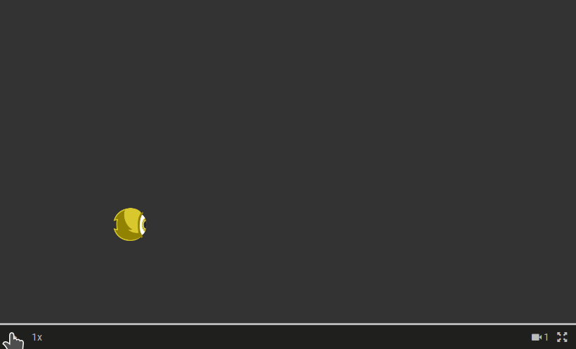

```json5
{
    "gameDetails": {
        // ... 
        "showEntityPath": {
            "pathColor": "#FFFFFF",
            "pathAlpha": 0.6,
            "clickedEntityTint": "#FF0000",
            "pathWidth": 0.4,
            "drawingTimeInterval": 0.2
        }
    },
    // ... see metadata at the beginning of this 
    //     guide in chapter "Replay File Metadata"
    "sections": [
        // Create a warrior an entity that moves 
        // around the map, just as we are used to.
        {
            "type": "StepSection",
            "entityId": "1",
            "attribute": "X",
            "endTime": 0,
            "endRangeValue": 40
        },
        {
            "type": "StepSection",
            "entityId": "1",
            "attribute": "Y",
            "endTime": 0,
            "endRangeValue": 30
        },
        {
            "type": "StepSection",
            "entityId": "1",
            "attribute": "WIDTH",
            "endTime": 0,
            "endRangeValue": 10
        },
        {
            "type": "StepSection",
            "entityId": "1",
            "attribute": "ROTATION_DEG",
            "endTime": 0,
            "endRangeValue": 0
        },
        {
            "type": "TextSection",
            "entityId": "1",
            "attribute": "TEXTURE",
            "endTime": 0,
            "text": "warrior-1.png"
        },
        {
            "type": "LinearSection",
            "entityId": "1",
            "attribute": "X",
            "endTime": 3,
            "endRangeValue": 110
        },
        {
            "type": "StepSection",
            "entityId": "1",
            "attribute": "ROTATION_DEG",
            "endTime": 3,
            "endRangeValue": 0
        },
        {
            "type": "LinearSection",
            "entityId": "1",
            "attribute": "ROTATION_DEG",
            "endTime": 5,
            "endRangeValue": 90
        },
        {
            "type": "LinearSection",
            "entityId": "1",
            "attribute": "Y",
            "endTime": 5,
            "endRangeValue": 30
        },
        {
            "type": "LinearSection",
            "entityId": "1",
            "attribute": "Y",
            "endTime": 7,
            "endRangeValue": 84
        }
    ]
}
```

### Match Details

This example demonstrates how to display additional match details besides the match viewer. 
Note that the first few details in the image below (Bot 1 vs. Bot 2, Duration: 0) are added automatically.

You can see how to configure `matchDetails` field [here](writing_replay_files.md#matchdetails).

*NOTE: Animation below might be laggy because it is stored as .gif.*

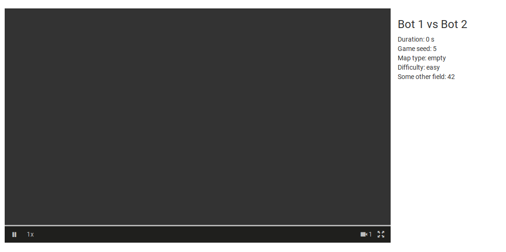

```json5
{
    "gameDetails": {
        "game": "lia-1",
        "version": "1.0",
        "backgroundColor": "#333333",
        "camera": {
        "width": 176,
        "height": 99
        },
        "showEntityPath": null
    },
    "matchDetails": [
        {
            "description": "Game seed",
            "value": 5
        },
        {
            "description": "Map type",
            "value": "empty"
        },
        {
            "description": "Difficulty",
            "value": "easy"
        },
        {
            "description": "Some other field",
            "value": 42
        }
    ],
    "charts": [],
    "sections": []
}
```

