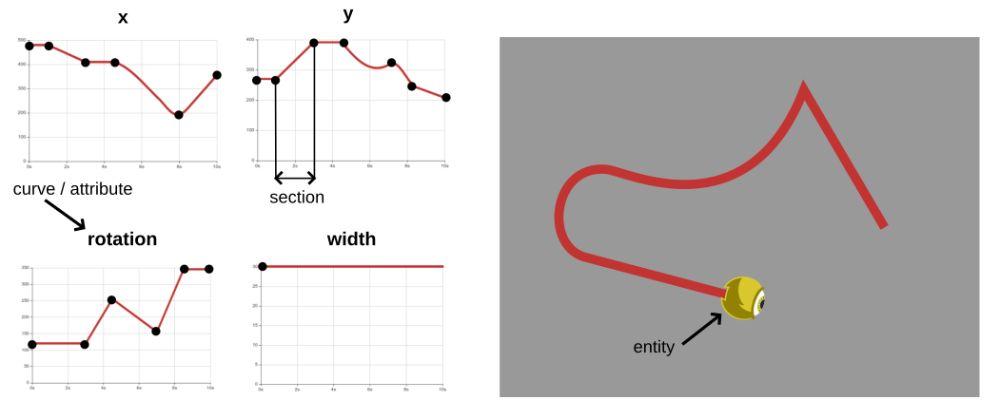

# Writing Replay Files

Here are all the details needed in order to add support for Planet Lia replay files to your game.

Table of content:
* [Description](#description) 
* [Examples](#examples)
* [Replay file format](#replay-file-format)
    * [Game details](#gameDetails)
    * [Match details](#matchDetails)
    * [Charts](#charts) 
    * [Sections](#sections)
        * [Entity types](#entity-types)
* [Misc](#misc)
    * [Animations format](#animations-format)
    * [Particles format](#particles-format)
 

## Description

Planet Lia provides support for displaying a replay of a match of any kind of 2d game as long as the match is stored in the replay file using the protocol described in this guide. Once you get the basic idea of how this works, it will be very easy to write a replay files for your game. For example for the [first Planet Lia game](TODO_insert_link) it only took around 100 lines of code to write a full fledged replay file from which a match like [this](TODO_link_to_a_match) can be displayed.

This are the main concepts of creating your replay files:
* Replay files are written in `json` format 
* Every entity, text, shape, ... that you can see in the game is stored as a set of **curves** and **sections** as described in the image below. Your sole goal is to learn how to represent your game elements as sections and write them to a replay file.



Sections are the main part of the replay file and hold the data about the whole match.
As described in the image above, each section represents values in a period of time for a specific attribute/curve of a certain entity on the map.
Consider that **each entity** on the map (obstacle, warrior unit, bullet, ...) has **its own attributes/curves** (x, y, width, height, rotation, texture, scale, ...) that change with time. 
**Each attribute** is built out of a **list of sections** representing its values in time. 


#### Why do we need this?
Storing the match data this way makes it really easy for the match viewer to replay it. 
All it needs to do is to get all currently visible entities on the map and get the values of all of their attributes in current time. 
Then it displays them using this data.

This also automatically supports changing speed of the replay when viewing the match, playing it backwards and jumping in time.


## Examples

Some examples of how to represent game elements in provided replay file format:

Entity Types
* [TextureEntity](replay_file_examples.md#textureentity)
* TextEntity ([text](replay_file_examples.md#textentity), [time](replay_file_examples.md#textentity---numeric-text))
* [ParticleEntity](replay_file_examples.md#particleentity)

Attribute Interpolation
* [Linear Interpolation](replay_file_examples.md#linear-interpolation)
* [Step Interpolation](replay_file_examples.md#step-interpolation)
* [Sine Interpolation](replay_file_examples.md#sine-interpolation)
* [Circular Interpolation](replay_file_examples.md#circular-interpolation)
* [Mixed Interpolation](replay_file_examples.md#mixed-interpolation)

Controlling Entities
* [Changing Multiple Attributes](replay_file_examples.md#changing-multiple-attributes)
* [Multiple Entities](replay_file_examples.md#multiple-entities)
* [Ordering Entities](replay_file_examples.md#ordering-entities)
* Entity Animation
* Attach Simple
* Attach Rotation
* Attach Rotation and Angle
* Attach No Scale
* Attach With Scale

Camera
* Camera Movement
* Multiple Cameras
* HUD Camera Elements

Other
* Charts (Statistics)
* Show Entity Path
* Match Details

## Replay file format

a replay file (`json` format) includes the parts listed below.

### gameDetails
Basic data about the game

* `game`: string - the name of the game
* `version`: string - the version of the game
* `backgroundColor`: string - the default background color of the replay viewer
* `camera` - details about the game camera. Note that the ratio between width and height must be 16:9.
    * `width`: number - width in world units of the area of the world that the camera can see when zoom is 1
    * `cameraHeight`: number - height in world units of the area of the world that the camera can see when zoom is 1
* `showEntityPath` - if not set to `null` it will display a path of a TextureEntity on the map
    * `pathColor`: string - the color of the path (eg. `"#FF0000`)
    * `pathAlpha`: number - the alpha of the path (between 0 and 1)
    * `clickedEntityTint`: string - an overlaying tint of an entity (eg`"#FF0000"`)
    * `pathWidth`: number - the width of the path in game world units
    * `drawingTimeInterval`: number - how often (in seconds) will be a circle representing the path drawn

<details><summary>Example</summary>
<p>

```json5
// Replay file
{
    "gameDetails": {
        "game": "lia-1",
        "version": "1.0",
        "backgroundColor": "#333333", 
        "camera": {
            "width": 176,
            "height": 99
        },
        "showEntityPath": {
            "pathColor": "#FFFFFF",
            "pathAlpha": 0.6,
            "clickedEntityTint": "#FF0000",
            "pathWidth": 0.4,
            "drawingTimeInterval": 0.2 
        }
    },
    "matchDetails": // ...
    "charts": // ...
    "sections": // ...
}
```
</p>
</details>  
        
### matchDetails
List of match details that will be displayed next to the match viewer. 
There can be 0 or more MatchDetail objects created in one replay file.
Content is up to you.

* **MatchDetail**:
    * `description`: string
    * `value`: number | string 

<details><summary>Example</summary>
<p>

```json5
// Replay file
{
    "gameDetails": // ...
    "matchDetails": [
        {
            "description": path,
            "value": "Downtown"
        },
        {
            "description": "Game seed",
            "value": 2
        },
        {
            "description": "Map width",
            "value": 176
        },
        {
            "description": "Map height",
            "value": 99
        }
    ],
    "charts": // ...
    "sections": // ...
}
```
</p>
</details> 

### charts
Defines a chart of data that will be displayed next to the match viewer.
There can be 0 or more Chart objects created in one replay file.

* **Chart**:
    * `name` - displayed as a title of the chart
    * `series` - list of each data series (lines in the chart)
        * `name` - name of the line
        * `color` - color of the line
        * `curveRef` - define from which curve the data for this chart line will be used. 
        If the curve belongs to an entity use fields `entityId` and `attribute` normally (eg. `{"entityId": "HUD_power", "attribute": "TEXT_NUMBER"}`).
        If the curve is standalone then set `attribute` field to `"NONE"` and use `entityId` for the id of the curve.    

<details><summary>Example</summary>
<p>

```json5
// Replay file
{
    "gameDetails": // ...
    "matchDetails": // ...
    "charts": [
        {
            "type": "Chart",
            "name": "Power",
            "series": [
                {
                    "name": "Username 1",
                    "color": "#FDCD49",
                    "curveRef": {
                        "entityId": "CURVE_power_p1",
                        "attribute": "NONE"
                    }
                },
                {
                    "name": "Username 2",
                    "color": "#019170",
                    "curveRef": {
                        "entityId": "CURVE_power_p2",
                        "attribute": "NONE"
                    }
                }
            ]
        },
        // ... More charts
    ],
    "sections": // ...
}
```
</p>
</details> 

### sections
As described in the image in [Description](#description) chapter, sections are used to represent [game entities](#entity-types). 
Entities are built out of attributes (curves), and each curve is built out of a list of sections.
To specify to which attribute of which entity a section belongs each section holds two fields:

* `entityId`: string 
    * to which entity the section belongs
    * **IMPORTANT:** Entities are created automatically as soon as the match viewer reads a section with a value of `entityId` field that has never occurred before. 
    Based on the prefix of `entityId` match viewer knows what type of an entity it must create ([TextureEntity](#textureentity), [TextEntity](#textentity), [ParticleEntity](#particleentity), [Camera](#camera), [Curve](#curve)). For example if match viewer reads a section with `entityId` se to `TEXT_123` then it will create a new [TexEntity](#text-entity). Check each entity type description to see what prefix they use.
* `attribute`: string 
    * to which attribute of the entity the section belongs
    * check what attributes are supported for different entity types in their documentation ([TextureEntity](#textureentity), [TextEntity](#textentity), [ParticleEntity](#particleentity), [Camera](#camera), [Curve](#curve))

By defining `entityId` and `attribute` to each section you can simply store all the sections of all entities in the replay file and the match viewer will be automatically able to connect them to correct entities and their attributes and then display the match.


There are multiple types of sections that you can use and chain together into one curve/attribute as long as all section use the same type (number, string or boolean). 

**Example:** *You can describe game unit movement with LinearSection when it moves linearly and StepSection when it teleports between two points. See the [example](TODO).*

Below are descriptions for currently supported sections (if you are missing a useful section type, feel free to open an issue in this repo with your requirements):

* #### StepSection
    * **Interpolation:** when queried for a value in time between `t0` and `t1` it returns a value at time `t0`
    * **Values type:** `number`
    * **Parameters**:
        * `entityId`: string
        * `attribute`: string
        * `endTime`: number
        * `endRangeValue`: number
    * [Example](TODO)
* #### LinearSection
    * **Interpolation:** when queried for a value in time between `t0` and `t1` it returns a value based on the linear function that goes through values at times `t0` and `t1`
    * **Values type:** `number`
    * **Parameters**:
        * `entityId`: string
        * `attribute`: string
        * `endTime`: number
        * `endRangeValue`: number
    * [Example](TODO)
* #### SineSection
    * **Interpolation:** when queried for a value in time between `t0` and `t1` it returns a value based on the sine sine function `A + r * sin(B * (t - t0) + C)`
    * **Values type:** `number`
    * **Parameters**:
        * `entityId`: string
        * `attribute`: string
        * `endTime`:number
        * `t0`: number
        * `A`: number
        * `r`: number
        * `B`: number
        * `C`: number
    * [Example](TODO)
* #### TextSection
    * **Interpolation:** when queried for a value in time between `t0` and `t1` it returns a value at time `t0`
    * **Values type:** `string`
    * **Parameters**:
        * `entityId`: string
        * `attribute`: string
        * `endTime`: number
        * `endRangeValue`: string
    * [Example](TODO)
* #### BooleanSection
    * **Interpolation:** when queried for a value in time between `t0` and `t1` it returns a value at time `t0`
    * **Values type:** `boolean`
    * **Parameters**:
        * `entityId`: string
        * `attribute`: string
        * `endTime`: number
        * `endRangeValue`: boolean
    * [Example](TODO)
* #### AttachSection
    * **Interpolation:** when queried for a value in time between `t0` and `t1` it returns a value at time `t0`
    * **Values type:** `Attach` - stores parameters described below
    * **Parameters**:
        * `entityId`: string
        * `attribute`: string
        * `endTime`: number
        * `attachToEntityId`: string - id of the entity you want this entity to attach to
        * `attachX`: boolean - if set to true, the attached entity x will move together with the base entity
        * `attachY`: boolean - if set to true, the attached entity y will move together with the base entity
        * `attachRotation`: boolean - if set to true, the attached entity will rotate around base entity as the base entity changes its angle. Note that the attached entity will not change its angle, only the position
        * `attachAngle`: boolean - if set to true, the angle of the attached entity will be added the angle of the base entity (it will rotate around its own center together with the base entity)
        * `attachScale`: boolean - if set to true, the attached entity will scale together with the base entity. x and y coordinates will also scale.
        * `attachVisibility`: boolean - if set to true, the attached entity will use the visibility of the base entity.
    * [Example](TODO)


## Entity types

A list of all supported entity types that the match viewer knows how to display. 
Note that they are automatically created out of sections provided in the replay file.

### TextureEntity
* These are your game objects that are visible on a screen (with images) such as players, obstacles, bullets, ...
* **entityId prefix:**
    * each `entityId` that does not have a prefix `"CAMERA_"`, `"TEXT_"` or `"PARTICLE_"` belongs to a TextureEntity
    * if you prefix it with `"HUD_"` it will be drawn on HUD (head up display aka user interface) and will not move, scale and rotate with the game camera
* **Attributes/Curves:**
    <table style="margin: 1em;">
    <tbody>
        <tr>
        <th>Attribute</th>
        <th>Value type</th>
        <th>Default value</th>
        <th>Description</th>
        </tr>
        <tr>
        <td>X</td><td>number</td><td>mandatory</td>
        <td>curve for x coordinate</td>
        </tr>
        <tr>
        <td>Y</td><td>number</td><td>mandatory</td>
        <td>curve for y coordinate</td>
        </tr>
        <tr>
        <td>WIDTH</td><td>number</td><td>mandatory</td>
        <td>curve for entity width</td>
        </tr>
        <tr>
        <td>HEIGHT</td><td>number</td><td>width</td>
        <td>curve for entity height</td>
        </tr>
        <tr>
        <td>ROTATION_DEG</td><td>number</td><td>0</td>
        <td>curve for entity rotation in degrees</td>
        </tr>
        <tr>
        <td>LAYER</td><td>number</td><td>1</td>
        <td>curve used to specify the order in which entities are drawn to the screen</td>
        </tr>
        <tr>
        <td>OPACITY</td><td>number</td><td>1</td>
        <td>curve for entity opacity/alpha value</td>
        </tr>
        <tr>
        <td>TEXTURE</td><td>string</td><td>mandatory</td>
        <td>
        curve that specifies which texture should be displayed (eg. "warrior.png")
        <br/><br/>
        if the value does not include "." sign it is considered to be an animation (eg. "shooting_warrior_1" will load "animations/shooting_warrior_1/anim.json" animation).
        Check the <a href="#animations-format">Animation format</a> to learn more.
        </td>
        </tr>
        <tr>
        <td>VISIBILITY</td><td>boolean</td><td>true</td>
        <td>curve to specify when the entity is being displayed</td>
        <tr/>
        <tr>
        <td>SCALE</td><td>number</td><td>1</td>
        <td>scale the entity</td>
        <tr/>
        <tr>
        <td>ATTACH</td><td>Attach</td><td>empty</td>
        <td>can attach this entity to another one, only accepts <a href="#attachsection">AttachSection</a> sections</td>
        <tr/>
    </tbody>
    </table>

### TextEntity
* These are your text game objects such as time, names under units, speech bubbles, ...
* **entityId prefix:**
    * each `entityId` that has a prefix `"TEXT_"` belongs to a TextEntity
    * if you prefix it with `"HUD_TEXT_"` it will be drawn on HUD (head up display aka user interface) and will not move, scale and rotate with the game camera
* **Attributes/Curves:**
    <table style="margin: 1em;">
    <tbody>
        <tr>
        <th>Attribute</th>
        <th>Value type</th>
        <th>Default value</th>
        <th>Description</th>
        </tr>
        <tr>
        <td>X</td><td>number</td><td>mandatory</td>
        <td>curve for x coordinate</td>
        </tr>
        <tr>
        <td>Y</td><td>number</td><td>mandatory</td>
        <td>curve for y coordinate</td>
        </tr>
        <tr>
        <td>TEXT</td><td>string</td><td>mandatory*</td>
        <td>curve that holds the text</td>
        </tr>
        <tr>
        <td>NUMBER_TEXT</td><td>number</td><td>mandatory*</td>
        <td>curve for text representing numbers. If it is set, the TEXT attribute/curve is ignored. For displaying moving numbers (eg. time) you can use number curves for less storage space used in replay file.</td>
        </tr>
        <tr>
        <td>NUMBER_TEXT_DEC</td><td>string</td><td>2</td>
        <td>curve that if NUMBER_TEXT is used it specifies how many decimals it should display</td>
        </tr>
        <tr>
        <td>COLOR</td><td>string</td><td>"#FFFFFF"</td>
        <td>curve for color (eg. #FF0000")</td>
        </tr>
        <tr>
        <td>ANCHOR_X</td><td>number</td><td>0.5</td>
        <td>curve for anchoring/aligning text (0 - align left, 0.5 - align center, 1 - align right)</td>
        </tr>
        <tr>
        <td>ANCHOR_Y</td><td>number</td><td>0.5</td>
        <td>same as ANCHOR_X just for y anchor/align</td>
        </tr>
        <tr>
        <td>FONT_SIZE</td><td>number</td><td>26</td>
        <td>curve for font size (eg. 32)</td>
        </tr>
        <tr>
        <td>FONT_FAMILY</td><td>number</td><td>"Arial"</td>
        <td>curve for fonts (eg. "Arial")</td>
        </tr>
        <tr>
        <td>FONT_STYLE</td><td>string</td><td>"normal"</td>
        <td>curve for style ("normal", "italic" or "oblique")</td>
        </tr>
        <tr>
        <td>FONT_WEIGHT</td><td>string</td><td>"normal"</td>
        <td>curve for weight ("normal", "bold", "bolder", "lighter" and "100", "200", "300", "400", "500", "600", "700", "800" or "900")</td>
        </tr>
        <tr>
        <td>ROTATION_DEG</td><td>number</td><td>0</td>
        <td>curve for entity rotation in degrees</td>
        </tr>
        <tr>
        <td>LAYER</td><td>number</td><td>1</td>
        <td>curve used to specify the order in which entities are drawn to the screen</td>
        </tr>
        <tr>
        <td>OPACITY</td><td>number</td><td>1</td>
        <td>curve for entity opacity/alpha value</td>
        </tr>
        <tr>
        <tr>
        <td>VISIBILITY</td><td>boolean</td><td>true</td>
        <td>curve to specify when the entity is being displayed</td>
        <tr/>
        <tr>
        <td>SCALE</td><td>number</td><td>1</td>
        <td>scale the entity</td>
        <tr/>
        <tr>
        <td>ATTACH</td><td>Attach</td><td>empty</td>
        <td>can attach this entity to another one, only accepts <a href="#attachsection">AttachSection</a> sections</td>
        <tr/>
    </tbody>
    </table>

### ParticleEntity
* Entity representing particle effects
* **entityId prefix:**
    * each `entityId` that has a prefix `"PARTICLE_"` belongs to a ParticleEntity
    * if you prefix it with `"HUD_PARTICLE_"` it will be drawn on HUD (head up display aka user interface) and will not move, scale and rotate with the game camera
* **Attributes/Curves:**
    <table style="margin: 1em;">
    <tbody>
        <tr>
        <th>Attribute</th>
        <th>Value type</th>
        <th>Default value</th>
        <th>Description</th>
        </tr>
        <tr>
        <td>X</td><td>number</td><td>mandatory</td>
        <td>curve for x coordinate</td>
        </tr>
        <tr>
        <td>Y</td><td>number</td><td>mandatory</td>
        <td>curve for y coordinate</td>
        </tr>
        <tr>
        <td>ROTATION_DEG</td><td>number</td><td>0</td>
        <td>curve for entity rotation in degrees</td>
        </tr>
        <tr>
        <td>LAYER</td><td>number</td><td>1</td>
        <td>curve used to specify the order in which entities are drawn to the screen</td>
        </tr>
        <tr>
        <td>OPACITY</td><td>number</td><td>1</td>
        <td>curve for entity opacity/alpha value</td>
        </tr>
        <tr>
        <tr>
        <td>VISIBILITY</td><td>boolean</td><td>true</td>
        <td>curve to specify when the entity is being displayed</td>
        <tr/>
        <tr>
        <td>SCALE</td><td>number</td><td>1</td>
        <td>scale the entity</td>
        <tr/>
        <tr>
        <td>EFFECT</td><td>string</td><td>mandatory</td>
        <td>curve for the name of the effect used (eg. "explosion" will load "particles/explosion.json" effect) <br/>
        NOTE: only the first section is used, one particle entity can't have multiple effects</td>
        <tr/>
        <tr>
        <td>EMIT</td><td>boolean</td><td>mandatory</td>
        <td>curve that defines when the particle will be emitted (true or false)</td>
        <tr/>
        <tr>
        <td>ATTACH</td><td>Attach</td><td>empty</td>
        <td>can attach this entity to another one, only accepts <a href="#attachsection">AttachSection</a> sections</td>
        <tr/>
    </tbody>
    </table>

### Camera
* Representing a game camera that defines which part of the map the viewer of the replay can see, defines its rotation, zoom and movement.
* **entityId prefix:**
    * each `entityId` that has a prefix `"CAMERA_"` belongs to a Camera
    * By default two additional cameras are created, `"CAMERA_MANUAL"` is the camera with title 1 in match-viewer when viewing the replay and that is always still and centered. Alongside also `"CAMERA_HUD"` is created that keeps other entities with `"HUD_"` prefix and that does not scale with game cameras. 
* **Attributes/Curves:**
* Curves:
    <table style="margin: 1em;">
    <tbody>
        <tr>
        <th>Attribute</th>
        <th>Value type</th>
        <th>Default value</th>
        <th>Description</th>
        </tr>
        <tr>
        <td>X</td><td>number</td><td>mandatory</td>
        <td>curve for x coordinate</td>
        </tr>
        <tr>
        <td>Y</td><td>number</td><td>mandatory</td>
        <td>curve for y coordinate</td>
        </tr>
        <tr>
        <td>ROTATION_DEG</td><td>number</td><td>0</td>
        <td>curve for entity rotation in degrees</td>
        </tr>
        <tr>
        <td>ZOOM</td><td>number</td><td>1</td>
        <td>curve for camera zoom</td>
        </tr>
    </tbody>
    </table>
### Curve
* Sections can also belong to a standalone curve and not as attributes to TextureEntity, TextEntity, ParticleEntity or Camera.
* **entityId prefix:**
    * each `entityId` that has a prefix `"CURVE_"` belongs to a standalone Curve
* **Attributes/Curves:**
    * It is a curve/attribute by itself and has not attributes
    * When a section belongs to a standalone curve, simply set `entityId` to this curve's entityId. `attribute` field will be ignored but you can set it to `NONE`
        

## Misc

### Animations format

Each [TextureEntity](#textureentity) has a `TEXTURE` attribute/curve that specifies which image will be displayed to represent it.
If the specified image does NOT include a dot (`.`) sign in its name (it means it has no suffix such as `my_image.png`) it is automatically interpreted to be an animation and thus the animation is loaded.

If a `TEXTURE` attribute/curve value in a specific time is set to `warrior_shooting_animation` then an animation will be displayed from a `warrior_shooting_animation` directory located in `assets/animations/` directory for that game.

The animation folder includes an `anim.json` file that has the following fields:
* `frames` - list of frames
    * `path`: string - relative path to the image representing the frame
    * `duration`: number - the amount of time the frame will be displayed for
* `loop`: boolean - specifies if the animation will loop or if it will only play once

You can put images referenced in the `anim.json` file in the same folder as `anim.json` file or you can reference them from somewhere else.

<details><summary>Example</summary>
<p>

```json5
// anim.json example
{
    "frames": [
        {
        "path": "1.png",
        "duration": 0.05
        },
        {
        "path": "2.png",
        "duration": 0.05
        },
        {
        "path": "3.png",
        "duration": 0.05
        }
    ],
    "loop": false
}
```
</p>
</details> 

### Particles format

[ParticleEntity](#particleentity) can display particle effects on the screen. 
You can specify a particle effect that will be used by creating a specific `json` file with a unique name (eg `collect_resource_effect.json`) into `assets/particles` directory for your game. Example of a simple explosion particle effect is displayed on the gif below.


The `json` file describing the effect includes the following fields:
* `images`: string[] - a list of relative paths to the images used in the effect
* `scale`: number - the scale of the used images on screen
* `settings`: 
    * settings as described in [pixi-particles](https://github.com/pixijs/pixi-particles) library that we use to display effects. 
    * use [interactive particle editor](https://pixijs.io/pixi-particles-editor/) to create your effects

Note that when referencing the effect in sections belonging to the `EFFECT` attribute/curve of a ParticleEntity you need to omit `.json` suffix.

<details><summary>Example</summary>
<p>

```json5
// collect_resource_effect.json example
{
    "images": ["particle.png"],
    "scale": 0.5,
    "settings": {
        "alpha": {
        "list": [
            {
            "value": 0.8,
            "time": 0
            },
            {
            "value": 0.1,
            "time": 1
            }
        ],
        "isStepped": false
        },
        "scale": {
        "list": [
            {
            "value": 0.7,
            "time": 0
            },
            {
            "value": 0.5,
            "time": 1
            }
        ],
        "isStepped": false
        },
        "color": {
        "list": [
            {
            "value": "ffffff",
            "time": 0
            },
            {
            "value": "ffffff",
            "time": 1
            }
        ],
        "isStepped": false
        },
        "speed": {
        "list": [
            {
            "value": 200,
            "time": 0
            },
            {
            "value": 100,
            "time": 1
            }
        ],
        "isStepped": false
        },
        "startRotation": {
        "min": 0,
        "max": 360
        },
        "rotationSpeed": {
        "min": 2,
        "max": 6
        },
        "lifetime": {
        "min": 0.5,
        "max": 0.6
        },
        "frequency": 0.03,
        "spawnChance": 0.8,
        "particlesPerWave": 1,
        "emitterLifetime": 0.31,
        "maxParticles": 1000,
        "pos": {
        "x": 0,
        "y": 0
        },
        "addAtBack": false,
        "spawnType": "circle",
        "spawnCircle": {
        "x": 0,
        "y": 0,
        "r": 10
        }
    }
}
```
</p>
</details> 
